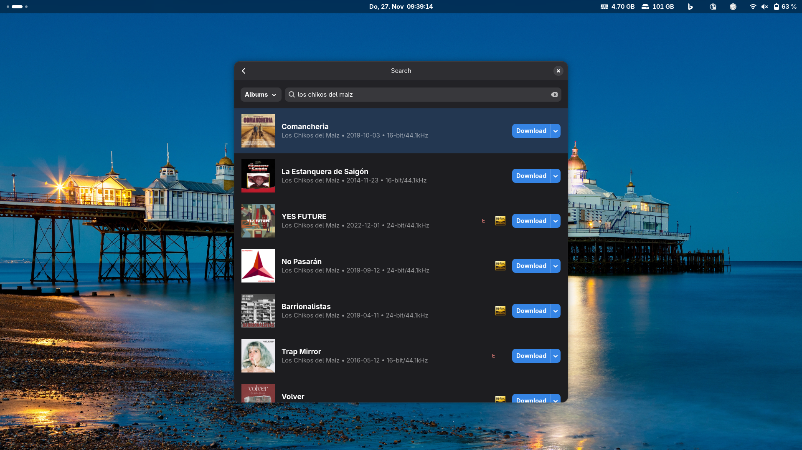

# qobuz-downloader

A modern, native Qobuz music downloader built with Rust and Libadwaita, providing a seamless GNOME desktop experience for downloading high-quality audio from Qobuz.




## Features

### Authentication
- **Dual Authentication Methods**:
  - Email + Password
  - User ID + Auth Token (recommended)
- **GNOME Keyring Integration**: Secure credential storage via the system keyring using `oo7`
- **Session Management**: Persistent login state across application restarts
- **Secure Credential Handling**: Passwords are never stored in plain text

### Download Capabilities
- **Multiple Quality Options**:
  - MP3 320kbps (Format ID: 5)
  - FLAC Lossless (Format ID: 6)
  - FLAC Hi-Res 24-bit &le;96kHz (Format ID: 7)
  - FLAC Hi-Res 24-bit &gt;96kHz & &le;192kHz (Format ID: 27)
- **Comprehensive Content Support**:
  - Individual tracks
  - Complete albums
  - Playlists
  - Artist discographies (via browse view)
- **Concurrent Download Workers**: Up to 3 simultaneous downloads with queue management
- **Automatic Metadata Embedding**: Comprehensive metadata tagging via `qobuz-api`
- **Automatic Cover Art Caching**: Cover images cached locally for offline display

### User Interface
- **Login-First Workflow**: Secure authentication before accessing download features
- **Dashboard View**:
  - URL/ID input for direct downloads
  - Quality selection dropdown with persistence
  - Real-time download queue with progress tracking
- **Browse Views**:
  - Album details with full track listing
  - Artist page with album catalog sorted by release date
  - Playlist details with track listing
- **Search Functionality**:
  - Search across the entire Qobuz catalog
  - Filter by Albums, Tracks, or All content
  - Visual results with cover art and metadata
  - One-click download or add-to-queue options
- **Download Queue Management**:
  - Visual progress tracking per item
  - Individual item cancellation
  - Cancel all functionality
  - Status indicators (Queued, Downloading, Completed, Cancelled, Failed)
- **Preferences Dialog**:
  - Default download quality selection
  - Custom download directory configuration
  - Settings persisted across sessions

### Technical Architecture
- **Modern Rust**: Built with async/await using Tokio runtime
- **GNOME HIG Compliant**: Follows GNOME Human Interface Guidelines for consistent UX
- **Libadwaita Integration**: Native GTK4 + Libadwaita widgets for authentic GNOME look and feel
- **Modular Domain Design**: Clean separation by capability with dedicated modules for auth, download, browse, search, and preferences
- **Structured Observability**: Tracing with `env-filter` for configurable log levels
- **Domain Error Types**: Typed errors via `thiserror` throughout the library boundary

## Prerequisites

### System Dependencies
- **GTK4 Development Libraries** (&ge;4.22)
- **Libadwaita Development Libraries** (&ge;1.9)

#### Ubuntu/Debian:
```bash
sudo apt install libgtk-4-dev libadwaita-1-dev
```

#### Fedora/RHEL:
```bash
sudo dnf install gtk4-devel libadwaita-devel
```

#### Arch Linux:
```bash
sudo pacman -S gtk4 libadwaita
```

### Qobuz Account
You need an active Qobuz subscription with download privileges. The application supports two authentication methods:

1. **Token-based (Recommended)**: User ID and Authentication Token
2. **Email-based**: Email and password

## Installation

### From Source

1. **Clone the repository**:
```bash
git clone https://github.com/your-username/qobuz-downloader.git
cd qobuz-downloader
```

2. **Build the project**:
```bash
cargo build --release
```

3. **Run the application**:
```bash
./target/release/qobuz-downloader
```

### Using Cargo (Development)
```bash
cargo run
```

## Configuration

### GNOME Keyring
Credentials are stored securely in the GNOME Keyring. On first launch, you will be prompted to enter your credentials through the login interface.

### Preferences
The application stores the following settings:
- **Default Quality**: Your preferred audio quality for downloads
- **Download Directory**: Custom output path for downloaded files

Settings are persisted automatically and can be modified via the Preferences dialog.

## Usage

### Initial Setup
1. Launch the application
2. Enter your Qobuz credentials in the login window
3. Click "Login" to authenticate
4. Credentials are securely stored in GNOME Keyring for future sessions

### Dashboard Features
- **URL Input**: Paste Qobuz URLs or IDs directly
- **Quality Selection**: Choose your preferred audio quality (persisted across sessions)
- **Download Button**: Start downloading the entered URL/ID
- **Download Queue**: Monitor active downloads with real-time progress

### Browse Views
- **Albums**: Click an album result to view full track listing with metadata
- **Artists**: Browse artist pages with complete discography sorted by release date
- **Playlists**: View playlist contents with all tracks listed

### Search Functionality
1. Navigate to the Search view
2. Enter your search query
3. Select search scope (Albums, Tracks, or All)
4. Browse results with cover art and metadata
5. Click "Download" for immediate download or "Add to Queue" for batch processing

### Download Queue Management
- **Cancel Individual Downloads**: Click the cancel button next to any queued item
- **Cancel All Downloads**: Use the "Cancel All" button to stop all active downloads
- **Clear Queue**: Remove completed/cancelled items from the queue display

## Project Structure

```
qobuz-downloader/
+-- src/
|   +-- main.rs              # Application entry point
|   +-- app.rs               # Application state and initialization
|   +-- window.rs            # Main window setup
|   +-- ui.rs                # Shared UI utilities (clamp, scrolled)
|   +-- types.rs             # Shared types (Quality enum)
|   +-- errors.rs            # Domain error types
|   +-- instrument.rs        # Tracing instrumentation
|   +-- auth/                # Authentication module
|   |   +-- mod.rs
|   |   +-- session.rs       # Session management
|   |   +-- login_view.rs    # Login window UI
|   |   +-- keyring.rs       # GNOME Keyring credential storage
|   +-- dashboard.rs         # Dashboard page with URL input and queue
|   +-- browse/              # Browse module
|   |   +-- mod.rs
|   |   +-- album_view.rs    # Album detail view
|   |   +-- artist_view.rs   # Artist detail view
|   |   +-- playlist_view.rs # Playlist detail view
|   |   +-- detail_common.rs # Shared detail view utilities
|   +-- search/              # Search module
|   |   +-- mod.rs
|   |   +-- controller.rs    # Search business logic
|   |   +-- view.rs          # Search UI
|   +-- download/            # Download module
|   |   +-- mod.rs
|   |   +-- manager.rs       # Concurrent download manager
|   |   +-- worker.rs        # Download worker threads
|   |   +-- progress.rs      # Progress tracking types
|   |   +-- view.rs          # Download queue UI
|   +-- cover_art/           # Cover art module
|   |   +-- mod.rs
|   |   +-- cache.rs         # Cover art caching
|   +-- preferences/         # Preferences module
|       +-- mod.rs
|       +-- dialog.rs        # Preferences dialog
|       +-- settings.rs      # Settings persistence
+-- assets/                  # Application assets (icons, images)
+-- specs/                   # Specification documents
+-- Cargo.toml               # Project dependencies and metadata
+-- README.md                # This documentation file
```

## Dependencies

### Core Dependencies
- **libadwaita** (&ge;0.9): GTK4-based adaptive UI library for GNOME
- **qobuz-api** (&ge;1.0): Qobuz API client library
- **tokio**: Async runtime for non-blocking operations
- **reqwest**: HTTP client for API requests
- **serde** + **serde_json**: Serialization for API responses and settings
- **tracing**: Structured observability
- **thiserror**: Domain error types
- **parking_lot**: High-performance mutex
- **oo7**: GNOME Keyring integration
- **async-channel**: Async channel communication

## Development

### Building
```bash
# Development build
cargo build

# Release build
cargo build --release
```

### Running Tests
```bash
cargo test
```

### Code Formatting
The project uses `rustfmt` with custom configuration:
```bash
cargo fmt
```

### Linting
```bash
cargo clippy --fix --allow-dirty --all-targets -- -W clippy::pedantic
```

## Contributing

Contributions are welcome! Please follow these guidelines:

1. **Fork the repository**
2. **Create a feature branch**: `git checkout -b feature/your-feature`
3. **Commit your changes**: `git commit -am 'Add some feature'`
4. **Push to the branch**: `git push origin feature/your-feature`
5. **Open a pull request**

## License

This project is licensed under the GNU General Public License v3.0 (GPL-3.0). See the [LICENSE](LICENSE) file for details.

## Acknowledgements

- **DJDoubleD**: Original C# Qobuz API and QobuzDownloaderX-MOD implementation that inspired this project
- **GNOME Project**: Libadwaita and GTK4 frameworks
- **Rust Community**: Excellent ecosystem and tooling

## Disclaimer

This application is an unofficial client for the Qobuz music streaming service. Use it responsibly and in accordance with Qobuz's terms of service. The developers are not affiliated with Qobuz and are not responsible for any misuse of this software.

**Warning**: Web player credential extraction may break at any time due to updates to the Qobuz Web Player.
